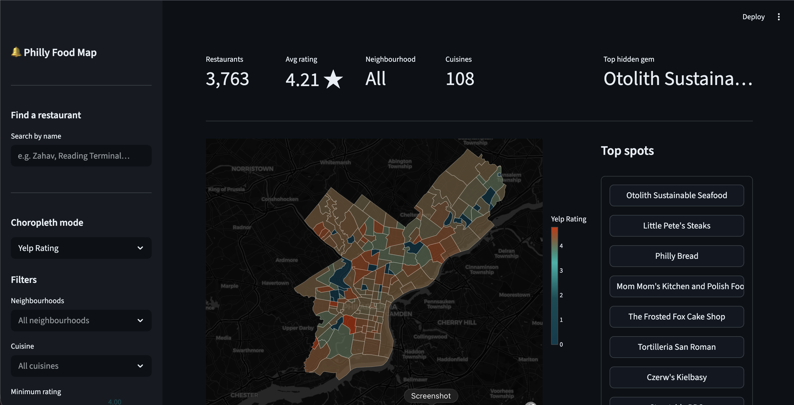

# Philly Food Map

The Philly Food Map is an interactive map dashboard built to show you where the good food is based on neighborhoods. 



## Features
* Find a restaurant by name
* Choropleth map colored by rating, count, and hidden gem score
* Filter by neighborhood, cuisine, rating, price, review count, and open status
* Hover over neighborhoods for an info summary
* Top bar with summary information based on filters
* Top spots table
* Find me a place: randomly chooses a restaurant for you based on preferences
* Ratings distribution table of selected neighborhoods


## Installation 

Use requirements.txt to download the imports to your conda environment or directly onto your base. 
```
$ conda create --name phillyMap --file requirements.txt
```
OR
```
$ pip install -r requirements.txt
```


## Run
The SLURM scripts contain the terminal commands need to run these files on the server or locally. I recommend running the process_data.py on the server, then app.py on your local machine.

Please run data_processing.py followed by app.py.  

---\
Helene Sov\
CS181DV Spring 2026